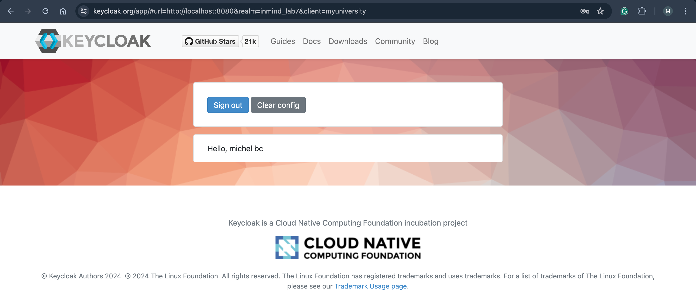
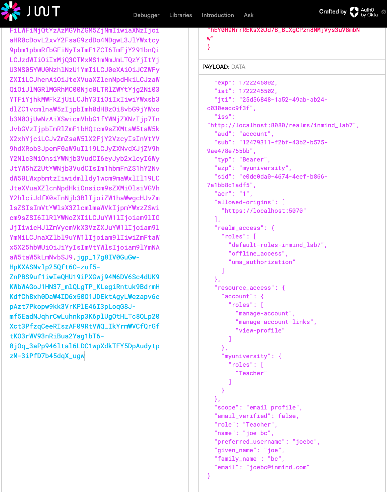
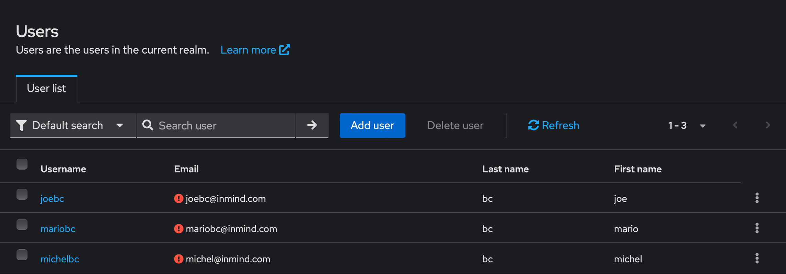

# Lab 7: (follow-up lab 4)

## Objective
Acquire practical experience with authentication and authorization by integrating .NET with
Keycloak. Implement functionality for serving static files within your .NET application. Set up and
utilize Azure Blob Storage for local development to manage file uploads and downloads.

## Adding Authentication and Authorization
### Steps:
• Set up Keycloak in a Docker container.
https://www.keycloak.org/getting-started/getting-started-docker
    
    docker run -p 8080:8080 -e KEYCLOAK_ADMIN=admin -e KEYCLOAK_ADMIN_PASSWORD=admin quay.io/keycloak/keycloak:25.0.2 start-dev

users:  http://localhost:8080/realms/inmind_lab7/account

admin: http://localhost:8080/realms/master/protocol/openid-connect/auth?client_id=security-admin-console&redirect_uri=http%3A%2F%2Flocalhost%3A8080%2Fadmin%2Fmaster%2Fconsole%2F&state=049d51ac-7e19-43a6-84cd-f5e317a47ba5&response_mode=query&response_type=code&scope=openid&nonce=407ffdc2-ac57-4ba6-8e6a-10679aef4258&code_challenge=QCe70eaWuMD2tfz4kEnOh6KD1fal34J6RKTBseED98o&code_challenge_method=S256

signin : http://localhost:8080/realms/inmind_lab7/protocol/openid-connect/auth?client_id=myuniversity&redirect_uri=https%3A%2F%2Fwww.keycloak.org%2Fapp%2F%23url%3Dhttp%3A%2F%2Flocalhost%3A8080%26realm%3Dinmind_lab7%26client%3Dmyuniversity&state=05e6e4cf-27fd-4e80-8ec1-df697793226e&response_mode=fragment&response_type=code&scope=openid&nonce=6c902d9d-1bdd-4c2b-8b86-9f53f5ba8824&code_challenge=T4dgTAHO3hC9tcd41AgHKuSN7bWhYlBb80XJmGvh7c0&code_challenge_method=S256

• Configure Keycloak to work with your .NET project.
packages:
- Microsoft.AspNetCore.Authentication.JwtBearer

https://jwt.io/ => token verifications

• Assign roles to each student and teacher within Keycloak.

• Implement authentication to secure the application.
• Restrict access to endpoints based on the roles assigned to users.

## Using Azure Blob Storage Emulator
### Steps:
• Set up an Azure Blob Storage emulator inside a Docker container.
• Configure Azure Blob Storage to handle file storage.
• Modify the database to support storing profile pictures for each user.
• Add endpoints to enable uploading and downloading of user profile images.

## Using Static Files
### Steps:
• Configure static file serving in the ww